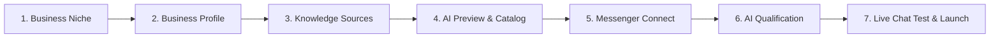

# 005. Onboarding Design Decision & UI Overhaul

## 1. Problem Statement & Context

The current onboarding flow in Kvik accomplishes its functional goals (business profile setup, knowledge base ingestion, channel connection, qualification rules, and bot testing). However, the interface suffers from visual clutter, double-stepper confusion, high cognitive load, dense copy, and unpolished interaction patterns.

### Critique of Current Implementation

1. **Nested / Double Stepper Confusion (Cognitive Overload)**:
   - The top bar displays a global progress indicator (`Step 3 of 7 / 43% Completed`).
   - Inside the Step 3 Knowledge Base card, there is a second horizontal sub-stepper with 5 stages (`1. 2GIS`, `2. Website`, `3. Documents`, `4. Notes`, `5. Summary`) with scroll chevrons.
   - Users get disoriented: "Am I on step 3 of 7 or step 5 of 5?".
2. **Immediate File Upload Anti-Pattern**:
   - In the previous flow, dropping or selecting a single file immediately dispatched `POST /onboarding/step/knowledge-documents` before the user could stage additional price lists, review file names, or remove mistaken uploads.
3. **Card-in-Card Visual Nesting**:
   - Page canvas → Glass card (`bg-card backdrop-blur-xl`) → 4 source cards in a row → Loading spinner sub-box → CTA buttons.
   - Excessive borders (`border-border`), multiple background layers, and redundant emojis create visual noise.
4. **Static & Heavy Loading States**:
   - AI scraping/parsing previously displayed a generic spinner with a dense block of explanatory text. It lacked dynamic phase progression, animated checkpoints, or shimmer skeletons.
5. **Weak CTA Visual Hierarchy**:
   - The primary action button blended into the card container with muted styling, reducing clarity on what the next step is.

---

## 2. Core Design Principles (Modern SaaS Standard)

Inspired by world-class SaaS onboarding flows (Linear, Stripe, Supabase, Vercel, Typeform):

- **Light & Focused**: Exactly one core objective per screen. Concise copy, minimal jargon, maximum clarity.
- **Progressive Disclosure**: Advanced configurations and secondary fields are disclosed smoothly as needed.
- **Multi-File Staging Flow**: Users stage multiple files (PDF, XLSX, DOCX, TXT) in a preview queue with sizes, file type icons, and remove `(×)` buttons, then trigger batch ingestion with **"Upload & Process (N files)"**.
- **Tactile & Fluid Motion**: Directional step transitions (`StepTransition` forward/backward), hover lifts on interactive cards (`scale: 1.02`), smooth progress bar interpolation, and live AI milestone animations.
- **Celebration & Proof-of-Work**: Visual proof of AI understanding (structured service badges, category counts, live test sandbox chat) with celebratory feedback on completion.

---

## 3. Step-by-Step UX/UI Specification



### Step 1: Niche Selection

- **Objective**: Pick business vertical (Beauty & Spa, Clinics, Fitness, Consulting, Other Appointment Services).
- **UI**:
  - Grid of elevated cards with distinctive icons, bold headings, and 2-3 feature bullets.
  - Hover animation: subtle scale (`1.02`), soft shadow, primary border accent.
  - Selection: instant visual selection state with auto-advance after 250ms.

### Step 2: Business Profile

- **Objective**: Collect company name, city, address, phone, working hours.
- **UI**:
  - Two cleanly separated logical sections: _Core Details_ (Name, Country, City) and _Operations & Contacts_ (Phone, Address, Working Hours).
  - Modern inputs with subtle focus states and smart defaults.

### Step 3: Knowledge Base Hub

- **Objective**: Connect business data via 2GIS, Website, Files, or Notes.
- **UI**:
  - **Single Unified Stepper**: Replaced the confusing double stepper with a clean source switcher.
  - **Multi-File Staging Queue**:
    - Drag & drop zone with multiple-file selection support.
    - Staged file list showing format icon (PDF / Excel / Word / TXT), formatted file size, and delete button `(×)`.
    - Batch upload trigger: **"Upload and Process Files (N)"** with live progress (`Processing 1 of 3...`).
  - **2GIS & Website**: Instant URL input with validation and one-click scraping trigger.
  - **Smart Notes**: Quick suggestion chips ("Prepayment rule", "Cancellation policy", "Parking info").

### Step 4: AI Extraction Preview & Review

- **Objective**: Display structured services and pricing extracted by AI.
- **UI**:
  - Dynamic AI phase indicator (`AiProcessingTimeline`): `[1. Reading documents] → [2. Extracting services & prices] → [3. Structuring catalog]`.
  - Structured summary card with category filters, service price tags, and quick edit links.
  - Prominent primary CTA: **"Knowledge Base Verified, Continue →"**.

### Step 5: Messenger Integration

- **Objective**: Connect WhatsApp Business or Instagram Direct.
- **UI**:
  - Distinct channel cards with "Recommended" and "Direct" badges.
  - Clean QR-code connection modal with 3-step phone instructions.

### Step 6: Qualification Rules

- **Objective**: Configure the 3 questions AI asks customers before booking.
- **UI**:
  - Editable pre-filled questions with quick-add chips and custom instructions textarea.

### Step 7: Live Sandbox & Launch Celebration

- **Objective**: Interactive chat test with the AI bot.
- **UI**:
  - Realistic chat simulator with typing indicator.
  - Final activation button triggering celebratory animation (`CelebrationCheckmark`) before dashboard redirect.

---

## 4. Component Structure (< 400 Lines Rule)

```
components/onboarding/
├── OnboardingWizard.tsx          # Main wizard container & layout
├── StepSelectNiche.tsx           # Niche selection cards
├── StepBusinessProfile.tsx       # Company profile form
├── StepKnowledgeSource.tsx       # Knowledge hub coordinator
│   ├── knowledge/
│   │   ├── Stage2gis.tsx         # 2GIS input stage
│   │   ├── StageWebsite.tsx      # Website scraper stage
│   │   ├── StageDocuments.tsx    # Staged multi-file upload stage
│   │   ├── StageNotes.tsx        # Smart notes stage
│   │   ├── StageConclusion.tsx   # Structured summary preview
│   │   └── KnowledgeEntryCard.tsx # Parsed item card
├── StepDataPreview.tsx           # Catalog confirmation step
├── StepConnectChannel.tsx        # WhatsApp / Instagram channel connection
├── StepQualification.tsx         # AI qualification rules
├── StepCompleteTest.tsx          # Interactive test sandbox
└── ui/
    ├── OnboardingHeader.tsx      # Top bar with logo and status
    └── OnboardingProgress.tsx    # Animated progress bar
```

---

## 5. Localization Rule Compliance

All user-facing text is managed via `locales/ru/*.json`:

1. Add new keys in `locales/translation_keys_new.json` under `onboarding.*`.
2. Run `node scripts/apply-translation-keys.mjs`.
3. Use `useTranslations('onboarding')` in client components without raw hardcoded strings.
