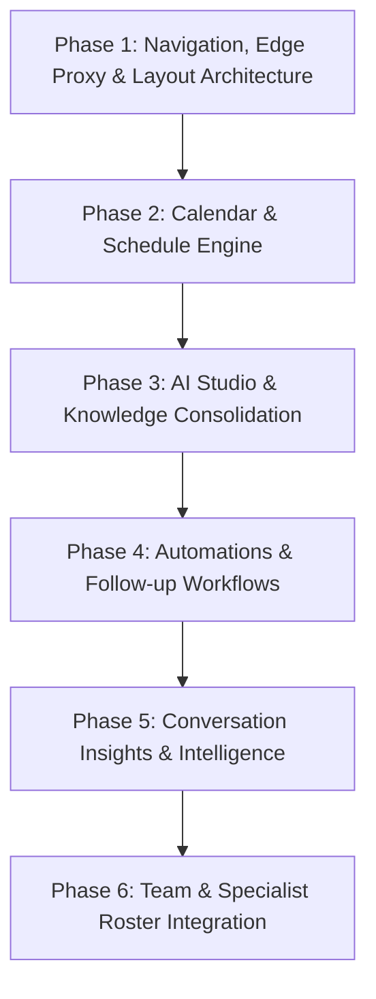

# 014 — Enterprise SaaS Design & Frontend Information Architecture Blueprint

> **Document Type:** Product Strategy, Information Architecture (IA), Technical Architecture & Frontend Redesign Blueprint  
> **Status:** Approved Architecture Specification  
> **Target Audience:** Product Managers, Frontend Engineers, UI/UX Designers, Technical Leads  
> **Inspiration Standards:** GoHighLevel (GHL), Intercom, Linear, Stripe, MoonAI/ManyChat, Cal.com, Retool  

---

## 1. Executive Summary & Problem Analysis

### 1.1 The Core Problem
The current layout and page organization suffers from several critical enterprise UX and architectural shortcomings:
1. **Flat, Unsegmented Navigation:** A flat list of disparate items (`overview`, `inbox`, `leads`, `bookings`, `settings`, `knowledge-base`, `dev-messaging`) without functional grouping, contextual hierarchy, or clear role scoping.
2. **Scattered Operational Core:** Critical workflows (like clinic working hours, master shift schedules, automated follow-ups, and AI conversation intelligence) are either buried inside generic settings tabs or lack dedicated operational homes.
3. **Cognitive Overload for Non-Technical Users:** Small business owners (beauty salon owners, clinic head doctors, fitness studio managers, receptionists) are overwhelmed when exposed to raw technical parameters (e.g., prompt tokens, RAG chunks, scraper endpoints, BullMQ follow-ups) instead of business outcomes (e.g., *"Свободные окна"*, *"Авто-дожим клиентов"*, *"Анализ отказов"*).
4. **Token Drain from Custom CSS:** Attempting to write hand-crafted CSS from scratch for every complex widget drains AI tokens, creates design inconsistencies, and increases maintenance fragility.
5. **Decoupled Billing Strategy:** Billing and financial subscriptions must NOT clutter the customer-facing operational portal; billing is managed strictly on a separate superadmin portal, with entitlement quotas passed down as read-only claims in JWT/workspace profile.

### 1.2 The Strategic Goal
Transform Kvik into an **Enterprise-Grade AI Operations & Sales Suite** for appointment-driven businesses. The frontend balances **deep operational power** (multi-staff calendars, omnichannel AI takeover, autonomous tool orchestration) with **radical simplicity and clarity for non-technical users**, backed by a resilient **Edge Proxy, Centralized Interceptor Engine, and Token-Efficient Component Ecosystem**.

---

## 2. Complete Application Feature Inventory & Domain Pillars

The platform is organized into **6 Core Functional Pillars** covering all current, in-flight, and planned capabilities (with Billing decoupled to the admin portal):

```
┌──────────────────────────────────────────────────────────────────────────────────────────────────┐
│                                   KVIK.AI ENTERPRISE ECOSYSTEM                                   │
└──────────────────────────────────────────────────────────────────────────────────────────────────┘
   │
   ├── 1. 💬 OPERATIONS & FRONT-DESK HUB
   │      ├── Unified Omnichannel Inbox (WhatsApp, Instagram Direct, Telegram)
   │      ├── Realtime Live Overflow & Human Intercept Mode (Auto-Takeover)
   │      ├── Multi-View Appointment Calendar (Day / Week / Month / Master Matrix / List)
   │      ├── Instant Booking Creation & Slot Conflict Engine
   │      └── Leads Mini-CRM (Pipeline Kanban, Client 360 Card, History)
   │
   ├── 2. 👥 WORKFORCE & AVAILABILITY ENGINE
   │      ├── Business Schedule & Clinic Operating Hours
   │      ├── Clinic Holiday & Emergency Schedule Overrides
   │      ├── Staff & Specialist Rosters (Roles, Services, Pricing Overrides)
   │      └── Specialist Shift Templates, Working Hours & Vacation Leave
   │
   ├── 3. 🧠 AI STUDIO & KNOWLEDGE INTELLIGENCE
   │      ├── Multi-Source Ingest (2GIS Importer, Web Scraper, PDFs/Docs, Categorized Notes)
   │      ├── Lead Screening & Qualification Rules (Mandatory questions, budget filters)
   │      ├── Persona, Tone of Voice & Multilingual Localization (RU / KZ / EN)
   │      ├── Autonomous Tool Orchestration (Calendar slots, booking tool, staff lookup)
   │      └── Live AI Sandbox & Realtime Prompt Inspector
   │
   ├── 4. ⚡ AUTOMATIONS & GROWTH (FOLLOW-UPS & OUTREACH)
   │      ├── Smart 24h & 72h Cold Lead Recovery Sequences (BullMQ engine)
   │      ├── Appointment Reminder Journey (24h before, 2h before, confirmation/cancel)
   │      ├── Post-Service Feedback & Re-engagement Triggers (30-day reactivation)
   │      └── Business Conversation Intelligence & AI Drop-off Analysis
   │
   ├── 5. 📊 EXECUTIVE ANALYTICS & REPORTING
   │      ├── Executive KPI Command Center (Revenue generated, bookings, conversion rate)
   │      ├── AI Efficiency & SLA Metrics (Bot vs Human resolution ratio, response speed)
   │      └── Operational Heatmaps (Peak messaging hours, master booking occupancy)
   │
   └── 6. ⚙️ INTEGRATIONS & PLATFORM GOVERNANCE
          ├── Messaging Channel Connectors (WhatsApp QR/Cloud API, Instagram Direct, Telegram)
          ├── External Calendar & CRM Sync (Google Calendar, Altegio / YCLIENTS)
          ├── Multi-Tenant Workspaces & Fast Workspace Switcher
          ├── Granular Role-Based Access Control (Owner, Admin/Manager, Specialist)
          └── Read-only Entitlement Banner (AI token usage & plan status from Superadmin)
```

---

### 2.1 Detailed Module Breakdown

| Domain Pillar | Module / Feature | Current Status | Non-Technical Business Description |
| :--- | :--- | :--- | :--- |
| **1. Operations** | **Unified Inbox** (`/inbox`) | In Production | Единый мессенджер для WhatsApp, Instagram и Telegram. Менеджер видит все переписки, может в 1 клик перехватить диалог или вернуть его боту. |
| **1. Operations** | **Interactive Calendar** (`/calendar`) | In Progress | Интерактивное расписание записей: просмотр по мастерам, дням и неделям, перетаскивание записей, предотвращение накладок. |
| **1. Operations** | **Leads CRM** (`/clients`) | In Production | Воронка клиентов: канбан и таблица, фильтры по статусам (Новый, Квалифицирован, Записан, Оплачен, Отказ). |
| **2. Workforce** | **Business Schedule** (`/schedule`) | In Progress | Общий график работы салона/клиники: рабочие часы по дням недели, праздничные дни, технические перерывы. |
| **2. Workforce** | **Staff & Shifts** (`/team`) | In Progress | Список специалистов, привязка услуг, индивидуальные графики смен, учет отпусков и больничных. |
| **3. AI Studio** | **Multi-Source Ingest** (`/ai-studio/sources`) | In Production | Загрузка данных компании: парсинг 2GIS в 1 клик, импорт сайта, загрузка PDF прайсов, текстовые заметки с акциями. |
| **3. AI Studio** | **Persona & Tone** (`/ai-studio/persona`) | In Production | Настройка характера ассистента: вежливый, экспертный, строгий, правила общения, языки (RU / KZ / EN). |
| **3. AI Studio** | **AI Sandbox & Inspector** (`/ai-studio/sandbox`) | In Production | Интерактивный тренажер для проверки ответов ИИ перед включением клиентам. |
| **4. Automations** | **Follow-Up Sequences** (`/automations/follow-ups`) | Planned | Автоматический дожим клиентов, которые перестали отвечать (через 24 и 72 часа). |
| **4. Automations** | **Appointment Reminders** (`/automations/reminders`) | Planned | Авто-напоминания клиентам о предстоящей записи за 24 часа и за 2 часа с кнопками подтверждения. |
| **4. Automations** | **Conversation Insights** (`/insights/conversations`) | Planned | Анализ диалогов ИИ: почему клиенты уходят без записи, частые вопросы, которых нет в базе знаний, оценка настроения. |
| **5. Analytics** | **Executive Dashboard** (`/analytics`) | In Production | Финансовая и операционная сводка: выручка от ИИ, количество записей, процент дошедших клиентов, экономия времени. |
| **6. Governance** | **Integrations** (`/integrations`) | In Production | Подключение WhatsApp по QR-коду, Instagram Direct, Telegram-бота, интеграция с Google Calendar / YCLIENTS. |
| **6. Governance** | **Company Settings & Team** (`/settings`) | In Production | Управление филиалами, права доступа сотрудников, безопасность, смена пароля. |

---

## 3. High-Level Technical Architecture: Request Layer, Proxies & State

To ensure maximum reliability, security, and developer speed without custom token-draining boilerplate, the network and data layer is organized around **4 Technical Pillars**:

```
┌──────────────────────────────────────────────────────────────────────────────────────────────────┐
│                                 TECHNICAL DATA & REQUEST PIPELINE                                │
└──────────────────────────────────────────────────────────────────────────────────────────────────┘
                                                │
 1. EDGE PROXY & ROUTE GUARD (proxy.ts / Next.js Middleware)
    ├── Fast Cookie Inspection (refresh_token validity, auth state)
    ├── RBAC Route Interception (blocks SPECIALIST from entering /settings, /ai-studio)
    └── Canonical Path Sanitization (/dashboard/* ➔ /* rewrite)
                                                │
                                                ▼
 2. CENTRALIZED API CLIENT & INTERCEPTOR ENGINE (lib/api/client.ts)
    ├── Request Interceptor:
    │   ├── Singleton Refresh Token Resolution (getOrRefreshToken())
    │   ├── Authorization: Bearer <access_token> injection
    │   └── Accept-Language: ru locale header injection
    └── Response Interceptor:
        ├── Silent 401 Re-Auth Queue (retry failed requests with new token)
        ├── Russian Error Message Normalizer (transformI18nMessages against api.json)
        └── Unified ApiError Normalization
                                                │
                                                ▼
 3. DATA FETCHING, CACHE & HOOKS LAYER (SWR / React Query + Custom Hooks)
    ├── Domain-Scoped Hooks (useBookings, useInbox, useStaff, useSchedule, useAiEngine)
    ├── Automatic Background Cache Deduplication & Stale-While-Revalidate
    └── Optimistic UI Mutations (instant calendar drop, instant lead stage change)
                                                │
                                                ▼
 4. REALTIME SOCKET.IO EVENT BRIDGE (hooks/useInboxRealtime, useCalendarRealtime)
    ├── Events: message.new, booking.created, booking.status_changed, lead.stage_updated
    └── Seamlessly mutates local SWR cache without full-page reloads
```

---

### 3.1 Next.js Edge Proxy & Route Guards (`proxy.ts`)
- **Single Source of Truth for Route Security:** Protects all routes before server components or client bundles execute.
- **Role-Based Guards at the Edge:**
  - `SPECIALIST` role: Automatically redirected away from `/settings`, `/ai-studio`, `/automations`, `/analytics` directly into `/calendar` or `/inbox`.
  - `ADMIN_MANAGER` & `OWNER`: Full access to operational and administrative routes.
- **Silent Auth State Guard:** Verifies `refresh_token` cookie presence; redirects unauthenticated visitors to `/login?from=<return_url>`.

---

### 3.2 Centralized Request & Response Interceptors (`lib/api/client.ts`)
- **Singleton Refresh Token Resolution:** Prevents "stampeding herd" concurrency bugs where multiple parallel requests fire multiple refresh requests. A single shared `refreshPromise` resolves the new JWT for all in-flight calls.
- **Zero Raw Error Codes:** The response interceptor passes all backend error payloads through `transformI18nMessages()`, translating backend error codes (e.g. `ERR_SLOT_CONFLICT`, `ERR_UNAUTHORIZED`) into user-friendly Russian strings via `locales/ru/api.json`.
- **Global Error Handling:** All errors are wrapped in a typed `ApiError(statusCode, localizedMessage, rawData)` class, allowing UI components to simply call `toast.error(err.message)`.

---

### 3.3 Domain Custom Hooks Architecture
Components **never call raw Axios directly**. Instead, all state and network access is encapsulated in domain-driven custom hooks:

```typescript
// Example: hooks/useSchedule.ts
export function useSchedule(workspaceId: string) {
  const { data, error, isLoading, mutate } = useSWR(
    workspaceId ? `/api/workspaces/${workspaceId}/schedule` : null,
    fetcher
  );

  const updateSchedule = async (newTemplates: ScheduleTemplateDto[]) => {
    // Optimistic local update
    mutate({ ...data, templates: newTemplates }, false);
    try {
      await apiUpdateSchedule(newTemplates);
      mutate();
      toast.success(t('schedule.saved_success'));
    } catch (err: any) {
      mutate(); // Rollback
      toast.error(err.message);
    }
  };

  return { schedule: data, isLoading, error, updateSchedule };
}
```

---

## 4. Component Library Strategy (Token-Efficient & Enterprise-Grade)

### 4.1 The Problem with Custom CSS & Unvetted Libraries
Writing custom CSS from scratch or using heavyweight legacy libraries:
- Drains hundreds of LLM tokens on every minor layout tweak.
- Introduces inconsistent spacing, broken dark/light theme tokens, and accessibility regressions.
- Heavyweight monolithic UI libraries (e.g. legacy Ant Design, Material UI) introduce massive bundle bloat and fight Next.js App Router and Tailwind CSS.

---

### 4.2 Recommended Standard: The Modern Enterprise Headless Stack

We standardize on a **proven, ultra-lightweight, token-efficient component stack** modeled on industry leaders (Linear, Supabase, Vercel, Stripe):

```
┌──────────────────────────────────────────────────────────────────────────────────────────────────┐
│                                RECOMMENDED COMPONENT ECOSYSTEM                                  │
├──────────────────────────┬─────────────────────────────┬─────────────────────────────────────────┤
│ Domain Layer             │ Recommended Library         │ Key Business Rationale                  │
├──────────────────────────┼─────────────────────────────┼─────────────────────────────────────────┤
│ 1. Core UI Primitives    │ shadcn/ui (Radix UI engine) │ • Zero runtime CSS overhead             │
│                          │ + Tailwind CSS v4           │ • Accessible (WAI-ARIA compliant)       │
│                          │                             │ • Token-efficient (no hand-written CSS) │
│                          │                             │ • Fully themeable via globals.css       │
├──────────────────────────┼─────────────────────────────┼─────────────────────────────────────────┤
│ 2. High-Density Tables   │ @tanstack/react-table (v8)  │ • Headless, ultra-fast (<13kB)          │
│    (Leads CRM, Staff)    │                             │ • Sorting, multi-filtering, pagination  │
│                          │                             │ • Dense enterprise row layouts          │
├──────────────────────────┼─────────────────────────────┼─────────────────────────────────────────┤
│ 3. Slide-Over Drawers    │ Vaul / Radix Sheet & Dialog │ • Smooth spring-physics drawers         │
│    (Customer 360, Booking│                             │ • Ideal for 3-pane enterprise layouts   │
├──────────────────────────┼─────────────────────────────┼─────────────────────────────────────────┤
│ 4. Calendar Engine       │ react-day-picker + date-fns │ • Headless, clean date arithmetic       │
│    & Date Pickers        │ + Custom Headless Grid      │ • Native Russian locale support         │
│                          │                             │ • Avoids heavy 250kB FullCalendar CSS   │
├──────────────────────────┼─────────────────────────────┼─────────────────────────────────────────┤
│ 5. Notifications         │ Sonner                      │ • Ultra-lightweight (3kB), accessible   │
│                          │                             │ • 1-line clean usage: toast.success()   │
├──────────────────────────┼─────────────────────────────┼─────────────────────────────────────────┤
│ 6. Icons                 │ Lucide React                │ • Tree-shakeable, 100% consistent icons │
├──────────────────────────┼─────────────────────────────┼─────────────────────────────────────────┤
│ 7. Micro-Interactions    │ Motion (Framer Motion)      │ • Already installed (^13.2.0)           │
│                          │                             │ • Smooth layout transitions             │
└──────────────────────────┴─────────────────────────────┴─────────────────────────────────────────┘
```

#### Why `shadcn/ui` + `Radix UI` is the Ultimate Fit:
1. **Zero Runtime & Zero Token Waste:** Components live directly in `components/ui/` as clean TSX files utilizing standard Tailwind utility classes. The AI agent does not need to invent custom CSS selectors or debug CSS specificity battles.
2. **Built-in Accessibility:** Focus traps, keyboard navigation (`Esc` to close modal, Arrow keys in dropdowns), and screen-reader tags work out-of-the-box.
3. **Seamless Token Integration:** Perfectly maps to the CSS variables in `app/globals.css` (`bg-primary`, `text-muted-foreground`, `border-border`, `.alert-destructive`).

---

## 5. Frontend Information Architecture (IA) & Navigation Redesign

### 5.1 The 2-Tier Navigation Hierarchy
The global navigation is organized into **4 logical functional sections** (with Billing removed completely):

```
┌───────────────────────────────┬─────────────────────────────────────────────────────────────────────────────────┐
│  KVIK.AI ENTERPRISE SIDEBAR   │  MAIN CONTENT WORKSPACE                                                         │
│                               ├─────────────────────────────────────────────────────────────────────────────────┤
│  🏢 [ Beauty Clinic Almaty ▼] │  Top Context Bar: [ Page Title ]    [ Action Buttons ]   [ Status: Active 🟢 ]  │
│                               ├─────────────────────────────────────────────────────────────────────────────────┤
│  ОПЕРАЦИИ                     │  Contextual Tabs: [ 📑 Обзор ]  [ 📅 Матрица мастеров ]  [ 📋 Список записей ]  │
│  ├── 💬 Входящие          (3) │─────────────────────────────────────────────────────────────────────────────────┤
│  ├── 📅 Календарь и Записи    │                                                                                 │
│  └── 👥 Клиенты и CRM         │  3-PANE WORKSPACE:                                                              │
│                               │  ┌───────────────────┬──────────────────────────────────┬────────────────────┐  │
│  ИИ И АВТОМАТИЗАЦИЯ           │  │ Filter / List     │ Primary Canvas                   │ Inspector Sheet    │  │
│  ├── 🧠 ИИ-Студия и База      │  │ (e.g. Chat List   │ (e.g. Active Chat Messages /     │ (e.g. Client 360 / │  │
│  ├── ⚡ Авто-дожим и цепочки  │  │   or Master List) │   Interactive Calendar Grid /    │   Quick Booking /  │  │
│  └── 🔍 Анализ диалогов       │  │                   │   CRM Kanban Board)              │   Shift Editor)    │  │
│                               │  │                   │                                  │                    │  │
│  КОМАНДА И ГРАФИК             │  │                   │                                  │                    │  │
│  ├── 🏢 График филиала        │  │                   │                                  │                    │  │
│  └── 👨‍⚕️ Специалисты          │  └───────────────────┴──────────────────────────────────┴────────────────────┘  │
│                               │                                                                                 │
│  УПРАВЛЕНИЕ                   │                                                                                 │
│  ├── 📊 Аналитика             │                                                                                 │
│  ├── 🔌 Интеграции            │                                                                                 │
│  └── ⚙️ Настройки             │                                                                                 │
│                               │                                                                                 │
│  ───────────────────────────  │                                                                                 │
│  👤 Анна Смирнова (Владелец)  │                                                                                 │
└───────────────────────────────┴─────────────────────────────────────────────────────────────────────────────────┘
```

---

### 5.2 Global Sidebar Grouping Specification

#### Group 1: 💬 ОПЕРАЦИИ (Daily Operations)
- `/inbox` — **Диалоги и переписка** (Badge: unread messages). Realtime omnichannel chats, bot takeover, internal notes.
- `/calendar` — **Календарь и записи** (Badge: today's pending bookings). Master schedule matrix, week view, list table.
- `/clients` — **База клиентов и CRM**. Funnel kanban, client history, tags, quick WhatsApp launch.

#### Group 2: 🤖 ИИ И АВТОМАТИЗАЦИЯ (AI & Automations)
- `/ai-studio` — **ИИ-Ассистент и База знаний**. 2GIS/Web/PDF sources, business persona, screening rules, test sandbox.
- `/automations` — **Авто-дожим и сценарии**. 24h/72h follow-ups, appointment reminders, client return triggers.
- `/insights` — **Анализ диалогов и ошибок**. AI conversation analysis, drop-off reasons, sentiment, missing FAQ suggestions.

#### Group 3: 👥 КОМАНДА И ГРАФИК (Team & Schedule)
- `/schedule` — **График работы филиала**. Operating hours, lunch breaks, slot durations, clinic holiday closures.
- `/team` — **Специалисты и смены**. Master roster, assigned services, individual working templates, vacation overrides.

#### Group 4: ⚙️ УПРАВЛЕНИЕ (Management & Governance)
- `/analytics` — **Аналитика и отчёты**. Conversion funnel, revenue attribution, bot SLA, occupancy heatmaps.
- `/integrations` — **Каналы и интеграции**. WhatsApp QR, Instagram Direct, Telegram, Google Calendar, CRM sync.
- `/settings` — **Настройки компании**. Profile, team permissions, security, developer tools.

---

## 6. UX & Design Principles for Non-Technical Users

To ensure salon administrators, clinic doctors, and business owners adopt the system effortlessly:

### 6.1 Principle 1: Zero-Jargon Philosophy (Business Metaphors)
Never expose technical LLM / database terms to users. Translate every developer concept into clear business outcomes:

| Technical / Developer Concept | Plain Russian Business Equivalent in UI | Visual Cue / Subtitle |
| :--- | :--- | :--- |
| `RAG Chunk / Vector Embeddings` | **База знаний и прайс-лист** | *"Факты, которые бот использует для точных ответов"* |
| `System Prompt Policy / Temperature` | **Характер и правила общения** | *"Тон ответов, приветствие и запретные темы"* |
| `BullMQ 24h/72h Follow-up Cron` | **Умный дожим клиентов** | *"Автоматические сообщения тем, кто перестал отвечать"* |
| `Slot Validation Hierarchy / Subtraction`| **Проверка свободных окон** | *"ИИ сам видит свободное время мастеров и не создает накладок"* |
| `Live Overflow / Human Intercept` | **Авто-возврат боту** | *"Если администратор не успел ответить за 30 сек, ИИ продолжит диалог"* |
| `Tool Calling / Function Execution` | **Действия ассистента** | *"ИИ умеет проверять график и записывать клиентов напрямую"* |

---

### 6.2 Principle 2: The Enterprise 3-Pane Layout Pattern
Every major operational page (`/inbox`, `/calendar`, `/clients`, `/ai-studio`) follows a unified 3-pane architecture:

1. **Left Pane (Queue / Selector):** Width `280px` – `320px`. Quick filters, search bar, and item list.
2. **Center Pane (Primary Canvas):** Flexible width (`flex-1`). Active Chat thread, Weekly Calendar Grid, Data Table, or Knowledge Cards.
3. **Right Pane (Contextual Slide-Over Drawer):** Width `360px` – `420px`.
   - In `/inbox`: Customer Profile 360, Last Bookings, 1-Click "+ Записать клиента", Internal Staff Notes.
   - In `/calendar`: Appointment Details, Status changer, Service/Master switcher, Client notes.
   - In `/ai-studio`: Realtime AI Prompt & Tool Call Inspector, Instant Test Sandbox.

---

### 6.3 Principle 3: Role-Based Adaptive Views (RBAC UX)
The interface automatically simplifies itself based on the logged-in user's role:

```
┌─────────────────────────────────────────────────────────────────────────────────────────────┐
│                                ROLE-BASED ADAPTIVE WORKSPACES                               │
├───────────────────────────────┬───────────────────────────────┬─────────────────────────────┤
│ 👨‍⚕️ SPECIALIST (Мастер)      │ 👩‍💼 ADMIN_MANAGER (Админ)     │ 👑 OWNER (Владелец)         │
├───────────────────────────────┼───────────────────────────────┼─────────────────────────────┤
│ • Мое расписание (My Calendar)│ • Входящие диалоги (Live Inbox│ • Сводка выручки и KPI      │
│ • Мои клиенты и записи        │ • Календарь всех мастеров     │ • Настройка ИИ и базы знаний│
│ • Мои смены и отпуска         │ • Быстрое бронирование        │ • Автоматизации и дожим     │
│ • Личные уведомления          │ • База клиентов (CRM)         │ • Управление командой и ФОТ │
│                               │ • Уведомления о накладках     │ • Интеграции и безопасность │
│ [Убраны все сложные настройки]│ [Фокус на операциях и бронях] │ [Полный доступ ко всем модулям│
└───────────────────────────────┴───────────────────────────────┴─────────────────────────────┘
```

---

## 7. Detailed Route Blueprint & Page Architecture

```
app/
├── (auth)/
│   ├── login/page.tsx
│   ├── register/page.tsx
│   └── forgot-password/page.tsx
│
├── (onboarding)/
│   └── onboarding/page.tsx                  # 5-step guided business wizard
│
└── (dashboard)/
    ├── layout.tsx                           # Global 2-Tier Enterprise Layout + Header
    │
    ├── overview/                            # Executive KPI Summary
    │   └── page.tsx
    │
    ├── inbox/                               # Omnichannel Unified Inbox
    │   ├── page.tsx                         # 3-Pane Chat: Filter + Thread + Customer 360
    │   └── [conversationId]/page.tsx
    │
    ├── calendar/                            # Appointment & Booking Suite
    │   ├── page.tsx                         # Multi-view Calendar: Day Matrix / Week / Month / List
    │   └── new/page.tsx                     # Quick Booking Slide-over
    │
    ├── clients/                             # Leads & Client CRM
    │   ├── page.tsx                         # Kanban Pipeline & High-density Table
    │   └── [clientId]/page.tsx              # Client Profile 360 Slide-over
    │
    ├── ai-studio/                           # AI Brain Center & Knowledge Base
    │   ├── page.tsx                         # Redirects to /ai-studio/sources
    │   ├── sources/page.tsx                 # 2GIS, Website, Documents, Notes
    │   ├── persona/page.tsx                 # Tone of voice, instructions, multilingual
    │   ├── qualification/page.tsx           # Screening questions & budget rules
    │   ├── tools/page.tsx                   # Calendar booking tool & custom actions
    │   └── sandbox/page.tsx                 # Interactive simulator & prompt inspector
    │
    ├── automations/                         # Automations & Growth Engine
    │   ├── page.tsx                         # Follow-ups (24h/72h), Reminders, Win-back
    │   └── follow-ups/page.tsx
    │
    ├── insights/                            # Business Conversation Intelligence
    │   └── conversations/page.tsx           # Drop-off analysis, sentiment, unanswered FAQ log
    │
    ├── schedule/                            # Business & Clinic Operating Hours
    │   ├── page.tsx                         # Working hours, slot durations, lunch buffers
    │   └── holidays/page.tsx                # Holiday & emergency clinic closures
    │
    ├── team/                                # Specialists & Shift Rosters
    │   ├── page.tsx                         # Staff list, roles, assigned services
    │   ├── [staffId]/schedule/page.tsx      # Specialist individual weekly shift template
    │   └── vacations/page.tsx               # Master leaves & sick day overrides
    │
    ├── analytics/                           # In-depth Reports & Funnels
    │   └── page.tsx                         # Revenue attribution, conversion, occupancy
    │
    ├── integrations/                        # Channels & External Sync
    │   ├── page.tsx                         # WhatsApp QR, Instagram Direct, Telegram
    │   └── calendars/page.tsx               # Google Calendar & YCLIENTS/Altegio sync
    │
    └── settings/                            # Workspace & Security Settings
        ├── page.tsx                         # Company Profile & Locations
        ├── account/page.tsx                 # Personal profile & password
        └── security/page.tsx                # Team roles, audit log, dev tools
```

---

## 8. Step-by-Step Implementation & Refactoring Roadmap



### Phase 1: Navigation, Edge Proxy & Layout Overhaul (Weeks 1)
- [ ] Implement new 2-tier categorized enterprise sidebar in `app/(dashboard)/layout.tsx` (`ОПЕРАЦИИ`, `ИИ И АВТОМАТИЗАЦИЯ`, `КОМАНДА И ГРАФИК`, `УПРАВЛЕНИЕ`).
- [ ] Remove `/billing` route and billing navigation links completely.
- [ ] Update `proxy.ts` to enforce RBAC edge guards for `SPECIALIST` vs `ADMIN_MANAGER` / `OWNER`.
- [ ] Create reusable enterprise page shell (`DashboardPageHeader.tsx`, `DashboardTabs.tsx`, `InspectorDrawer.tsx`).
- [ ] Add all new Russian localization keys to `locales/ru/dashboard.json`.

### Phase 2: Calendar & Schedule Engine (Weeks 2)
- [ ] Build `/calendar` page with multi-view switcher (Master Columns, Week Grid, Month, List Table).
- [ ] Implement Quick Booking Modal and slide-over inspector drawer with real-time slot conflict detection.
- [ ] Build `/schedule` (Clinic working hours, slot durations, holiday overrides).

### Phase 3: AI Studio & Knowledge Base Consolidation (Weeks 3)
- [ ] Consolidate `/ai-studio` into a unified 5-tab workspace (`Источники`, `Характер`, `Квалификация`, `Инструменты`, `Песочница`).
- [ ] Embed interactive AI sandbox simulator with live tool call and token inspector.

### Phase 4: Automations & Follow-up Sequences (Weeks 4)
- [ ] Create `/automations` hub with visual cards for 24h/72h cold lead recovery, appointment reminders, and reactivation triggers.
- [ ] Add template variable preview (`{имя}`, `{услуга}`, `{свободные_окна}`) and trigger toggle controls.

### Phase 5: Conversation Intelligence & Insights (Weeks 5)
- [ ] Create `/insights/conversations` page with drop-off funnel analytics, sentiment analysis, and unanswered question gap logger.
- [ ] Implement 1-click `[ Добавить ответ в Базу Знаний ]` workflow from unanswered client queries.

### Phase 6: Team & Specialist Roster (Weeks 6)
- [ ] Build `/team` specialist roster with service assignments and schedule status.
- [ ] Build `/team/[staffId]/schedule` for individual master shift templates and vacation overrides.

---

## 9. Success Metrics & Non-Technical Acceptance Criteria

| Goal | Metric / Verification | Target |
| :--- | :--- | :--- |
| **Simplicity & Speed** | Time for a salon admin to find today's bookings or create a manual appointment | **< 15 seconds (≤ 2 clicks)** |
| **Zero Confusion** | Usability test with non-technical business owner without prior training | **0 questions regarding technical terms** |
| **Visual Aesthetics** | First impression benchmark against Linear, Stripe, and GoHighLevel | **Modern, crisp, dense, enterprise-grade** |
| **Operational Reliability**| Conflict prevention when booking slots across multiple masters | **0 double-bookings or invalid slot generation** |
| **Code Modularity** | Maximum file size constraint across all new frontend components | **Strictly < 300 LOC per file** |

---

*Document prepared for Kvik.ai Platform Engineering & Product Design.*
