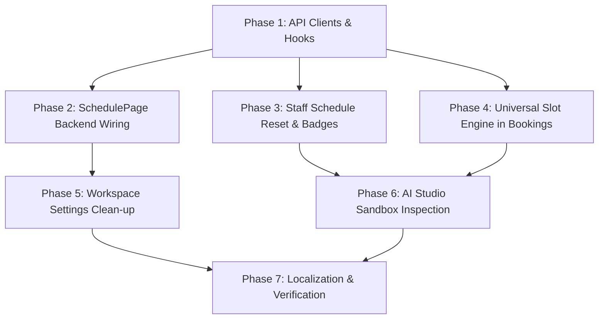

# 015 — Frontend Business Schedule, Staff Availability & Universal Slot Engine Plan

> **Document Type:** Frontend Architectural Blueprint & Implementation Specification  
> **Target Audience:** Frontend Engineers, UI/UX Engineers, Product Leads  
> **Status:** Planning & Execution Blueprint  
> **Related Backend Specification:** [044_BOOKING_TOOL_AND_SCHEDULE_SYSTEM_PLAN.md](file:///c:/Users/Honor/Desktop/tech/web/kvik/kvik/dev_docs/backend/044_BOOKING_TOOL_AND_SCHEDULE_SYSTEM_PLAN.md)  
> **Design & Enterprise Standards:** [AGENTS.md](file:///c:/Users/Honor/Desktop/tech/web/kvik/kvik/AGENTS.md) (Modern Minimalist Light SaaS, MoonAI Violet `#7C3AED`, strictly Russian UI, modular <=400 lines)

---

## 1. Executive Summary & Component Placement Analysis

### 1.1 Current Frontend Logical Architecture ("As-Is")
The Kvik frontend follows a 6-core primary navigation model with contextual top tabs and dedicated functional domains:
1. **Operations & Calendar Hub (`/calendar`, `/bookings`):**
   - Main route `/calendar` contains top tabs:
     - `bookings`: Multi-view appointment calendar (Matrix, Month, List) via `BookingCalendar.tsx`, `BookingList.tsx`, `StaffSelector.tsx`, `CreateBookingModal.tsx`, `RescheduleModal.tsx`.
     - `schedule`: Embedded `SchedulePage.tsx` for clinic working hours.
     - `team`: Embedded `TeamPage.tsx` for staff rosters.
2. **Business Schedule Management (`/schedule`, `components/dashboard/schedule/SchedulePage.tsx`):**
   - Currently uses **mocked local state** (`DEFAULT_DAYS`, local mock holiday arrays).
   - Has **no active connection** to the newly implemented backend endpoints (`/workspaces/schedule`, `/workspaces/schedule/overrides`).
3. **Staff Roster & Individual Availability (`/settings/staff`, `components/dashboard/settings/staff/*`):**
   - `StaffList.tsx`, `AvailabilityModal.tsx`, `AvailabilityEditor.tsx`.
   - `useStaffSchedule` supports saving custom templates and date overrides, but lacks the ability to **reset staff to clinic defaults** (`DELETE /staff/:id/schedule`).
   - UI does not distinguish between a staff member using custom hours versus inheriting the business schedule.
4. **Workspace Settings (`/settings/workspace`, `WorkspaceForm.tsx`):**
   - Retains a legacy freeform string input `workingHours` (`"Пн-Вс: 10:00 - 21:00"`), which was removed from the backend workspace model and DTOs.
5. **Universal Slot Engine & Booking Flow (`hooks/useSlots.ts`, `CreateBookingModal.tsx`):**
   - `useSlots.ts` currently blocks fetching if `staffId` is not provided, preventing general clinic slot lookups.
   - `AvailableSlotsResponse` in `lib/api/bookings.ts` does not parse `isBusinessOpen`, `dayOfWeek`, `totalAvailableSlots`, or the multi-staff array returned per slot.
   - Datetime construction in modal forms used simple ISO suffix formatting (`${date}T${time}:00Z`) without local timezone awareness.
6. **AI Studio & Sandbox (`/ai-studio`, `components/dashboard/settings/ai-agent/*`):**
   - `AiStudioPage.tsx` orchestrates Knowledge Base sources, Persona/Agent instructions, Automations, Insights, Qualification, and Business Context.
   - `AiSandboxDrawer.tsx` renders live simulation responses and tool call logs (`get_available_slots`, `get_business_schedule`, `get_staff_members`, `create_booking`).

---

## 2. Backend Changes & Frontend Alignment Gap Matrix

| Functional Area | Backend State (044 Blueprint) | Current Frontend State | Required Frontend Target |
| :--- | :--- | :--- | :--- |
| **Business Weekly Schedule** | `GET /workspaces/schedule`, `PUT /workspaces/schedule` (`WorkspaceScheduleTemplate` 7 days: `startTime`, `endTime`, `isOpen`, `slotDuration`). | Mocked state in `SchedulePage.tsx`. | Real SWR hook `useWorkspaceSchedule()`, connected weekly schedule editor with duration & buffer configuration. |
| **Business Holiday Overrides** | `POST /workspaces/schedule/overrides`, `DELETE /workspaces/schedule/overrides/:id` (`WorkspaceScheduleOverride`: `date`, `isClosed`, `startTime`, `endTime`, `reason`). | Mocked local holiday array. | Integrated override management with date picker, reason input, instant deletion, and badge display. |
| **Workspace Settings Working Hours** | Unstructured `workingHours` string removed from DB and DTOs. | Text input field in `WorkspaceForm.tsx`. | Remove text input; replace with dynamic schedule preview banner and deep-link to `/schedule`. |
| **Staff Schedule Fallback & Reset** | `DELETE /staff/:id/schedule` resets staff to inherit business schedule. 0 templates = fallback to business template. | No reset endpoint in `lib/api/staff.ts`; no button in UI. | Add `resetSchedule()` to `staffApi` & `useStaffSchedule()`. Add "Сбросить на график компании" button and inheritance badge in `AvailabilityModal.tsx`. |
| **Universal Slot Engine API** | `GET /bookings/slots?date=YYYY-MM-DD&staffId=...&durationMinutes=...`. Returns `isBusinessOpen`, `totalAvailableSlots`, `slots: [{ startTime, endTime, available, staff: [{ id, name }] }]`. | `useSlots.ts` requires `staffId`; simple slot DTO. | Update DTOs in `lib/api/bookings.ts`, allow `staffId` to be optional in `useSlots.ts`, show clinic-wide slots with specialist badges in booking modals. |
| **AI Studio & Simulator Logs** | 4 tools: `get_business_schedule`, `get_staff_members`, `get_available_slots`, `create_booking`. | Generic tool call JSON viewer in `AiSandboxDrawer.tsx`. | Enhanced formatting for schedule & slot tool execution logs in test sandbox. |
| **Localization & Design** | Russian error & status codes. | Partial keys in `translation_keys_new.json`. | Full Russian localization for all schedule, slot, and override states via `next-intl`. |

---

## 3. Technical Design & Data Flow Architecture

### 3.1 Availability & Slot Hierarchy Flow

```
┌────────────────────────────────────────────────────────────────────────┐
│                        KVIK FRONTEND DATA LAYER                        │
└────────────────────────────────────────────────────────────────────────┘
                                   │
       ┌───────────────────────────┼───────────────────────────┐
       ▼                           ▼                           ▼
┌──────────────────┐      ┌──────────────────┐      ┌──────────────────┐
│ Schedule Page    │      │ Staff Settings   │      │ Booking / Slots  │
│ (/schedule)      │      │ (/settings/staff)│      │ (/calendar)      │
└──────────────────┘      └──────────────────┘      └──────────────────┘
       │                           │                           │
       ▼                           ▼                           ▼
┌──────────────────┐      ┌──────────────────┐      ┌──────────────────┐
│ useWorkspace-    │      │ useStaffSchedule │      │ useAvailableSlots│
│ Schedule()       │      │ (staffId)        │      │ (date, staffId)  │
└──────────────────┘      └──────────────────┘      └──────────────────┘
       │                           │                           │
       ▼                           ▼                           ▼
┌──────────────────────────────────────────────────────────────────────┐
│                           API CLIENT LAYER                           │
│  - workspacesScheduleApi (GET/PUT /workspaces/schedule, overrides)   │
│  - staffApi (GET/PUT/DELETE /staff/:id/schedule, overrides)          │
│  - bookingsApi (GET /bookings/slots, POST /bookings)                 │
└──────────────────────────────────────────────────────────────────────┘
```

---

## 4. Detailed Implementation Specifications

### 4.1 Module 1: Business Schedule API Client & Hook
* **File:** `lib/api/workspacesSchedule.ts` (NEW)
  * `WorkspaceScheduleTemplateDto`: `{ dayOfWeek: number, startTime: string, endTime: string, isOpen: boolean, slotDuration: number }`
  * `WorkspaceScheduleOverrideDto`: `{ id: string, workspaceId?: string, date: string, isClosed: boolean, startTime?: string | null, endTime?: string | null, reason?: string | null }`
  * `WorkspaceScheduleResponse`: `{ templates: WorkspaceScheduleTemplateDto[], overrides: WorkspaceScheduleOverrideDto[] }`
  * Methods: `getSchedule(from?, to?)`, `setSchedule(templates)`, `addOverride(payload)`, `removeOverride(id)`.
* **File:** `hooks/useWorkspaceSchedule.ts` (NEW)
  * SWR integration with key `['workspaces/schedule', from, to]`.
  * Mutation helpers: `setSchedule(templates)`, `addOverride(payload)`, `removeOverride(id)`, `refresh()`.

### 4.2 Module 2: Business Schedule Management View
* **File:** `components/dashboard/schedule/SchedulePage.tsx` (REFACTOR)
  * Replace mock state with `useWorkspaceSchedule()`.
  * Tab 1: **Еженедельный график (Weekly Schedule)**
    * 7-day card rows with `isOpen` toggle, `startTime` / `endTime` inputs.
    * Slot duration selector (30, 45, 60, 90, 120 min) mapped into templates.
    * Buffer time selector.
    * Instant save button with loading indicator and toast feedback.
  * Tab 2: **Праздники и исключения (Holiday & Emergency Overrides)**
    * Real list of active overrides from backend.
    * Form to add override (`date`, `isClosed`, `startTime`, `endTime`, `reason`).
    * One-click delete with instant SWR revalidation.

### 4.3 Module 3: Staff Schedule Reset & Fallback UI
* **File:** `lib/api/staff.ts` (UPDATE)
  * Add `resetSchedule: async (id: string) => apiClient.delete<{ code: string; message: string }>(`/staff/${id}/schedule`)`.
* **File:** `hooks/useStaff.ts` (UPDATE)
  * Expose `resetSchedule` in `useStaffSchedule(staffId)`.
* **File:** `components/dashboard/settings/staff/AvailabilityModal.tsx` (UPDATE)
  * Detect if staff member has custom templates or is currently inheriting clinic schedule.
  * Add "Сбросить на график компании" (Reset to clinic defaults) action button.
  * Display a banner indicating: *"Специалист использует индивидуальный график"* vs *"Специалист наследует общий график филиала"*.

### 4.4 Module 4: Universal Slot Engine & Booking Modals
* **File:** `lib/api/bookings.ts` (UPDATE)
  * Update `TimeSlot`: `{ startTime: string, endTime: string, available: boolean, staff?: Array<{ id: string, name: string }> }`.
  * Update `AvailableSlotsResponse`: `{ date: string, dayOfWeek?: number, isBusinessOpen?: boolean, durationMinutes?: number, totalAvailableSlots?: number, slots: TimeSlot[] }`.
* **File:** `hooks/useSlots.ts` (UPDATE)
  * Make `staffId` optional: `shouldFetch = Boolean(params.date)`.
  * Expose `isBusinessOpen`, `totalAvailableSlots`, and `dayOfWeek`.
* **File:** `components/dashboard/bookings/CreateBookingModal.tsx` & `RescheduleModal.tsx` (UPDATE)
  * Handle date changes when "Любой специалист" is selected — query slots across all active specialists.
  * If `isBusinessOpen === false`, display an alert banner: *"Филиал закрыт в выбранный день (Праздник / Выходной)"*.
  * Show specialist pills/name badges on slot tiles when multiple staff members are available.
  * Proper ISO date/time construction avoiding UTC skew.

### 4.5 Module 5: Workspace Settings Clean-Up
* **File:** `components/dashboard/settings/workspace/WorkspaceForm.tsx` (UPDATE)
  * Remove obsolete `workingHours` text input from form state and DTO payload.
  * Add a Schedule Status Card with a direct shortcut link to `/schedule` (e.g., *"График работы настроен в модуле График филиала"*).

### 4.6 Module 6: AI Studio & Sandbox Tool Log Enhancements
* **File:** `components/dashboard/settings/ai-agent/AiSandboxDrawer.tsx` (UPDATE)
  * Enhance tool call visualizations for `get_business_schedule`, `get_staff_members`, `get_available_slots`, and `create_booking`.
  * Render structured badges for available slots count and open/closed status.

### 4.7 Module 7: Russian Localization & Keys Synchronization
* **File:** `locales/translation_keys_new.json` (UPDATE)
  * Ensure all keys for schedule templates, holiday overrides, staff reset actions, and slot notices exist in Russian.
  * Run `node scripts/apply-translation-keys.mjs` and `node scripts/export-translation-keys.mjs`.

---

## 5. Step-by-Step Implementation Roadmap



1. **Phase 1: API Clients & Data Layer**
   - Create `lib/api/workspacesSchedule.ts`.
   - Create `hooks/useWorkspaceSchedule.ts`.
   - Update `lib/api/staff.ts` and `hooks/useStaff.ts` (`resetSchedule`).
   - Update `lib/api/bookings.ts` and `hooks/useSlots.ts` (rich slots & optional `staffId`).
2. **Phase 2: Schedule Management View**
   - Refactor `components/dashboard/schedule/SchedulePage.tsx` to use `useWorkspaceSchedule()`.
   - Implement real saving of weekly templates and deletion/addition of holiday overrides.
3. **Phase 3: Staff Availability & Clinic Schedule Inheritance**
   - Refactor `AvailabilityModal.tsx` to support resetting to clinic defaults and displaying inheritance status.
4. **Phase 4: Universal Slot Engine in Bookings & Calendar**
   - Refactor `CreateBookingModal.tsx` and `RescheduleModal.tsx` to handle optional staffId, clinic closed days, and specialist badges.
5. **Phase 5: Workspace Profile Clean-Up**
   - Remove legacy `workingHours` string from `WorkspaceForm.tsx` and link to `/schedule`.
6. **Phase 6: AI Studio Sandbox Visualizer**
   - Enhance `AiSandboxDrawer.tsx` with formatted badge view for the 4 schedule/booking tools.
7. **Phase 7: Translation & Type-Check Verification**
   - Update `translation_keys_new.json`.
   - Run translation sync scripts.
   - Run `npm run build` or TypeScript check to guarantee 0 errors.

---

## 6. Verification & Quality Assurance Plan

### 6.1 Automated Verification
- Run `npx tsc --noEmit` to verify type safety across all modified API clients, hooks, and UI components.
- Run translation script: `node scripts/verify-loc.mjs`.

### 6.2 Manual Verification Checklist
1. **Schedule Page:**
   - Open `/schedule` (or Calendar -> График работы).
   - Change Monday hours from 09:00 to 10:00, click "Сохранить график" -> Verify persistence on page refresh.
   - Add a holiday override (e.g., 2026-10-25 "День Республики") -> Verify it appears in list.
   - Delete holiday override -> Verify it disappears.
2. **Staff Availability:**
   - Open Settings -> Специалисты -> Настроить график.
   - Click "Сбросить на график компании" -> Verify custom templates are cleared and staff inherits clinic hours.
3. **Booking Creation:**
   - Open Calendar -> "Новая запись".
   - Select date with "Любой специалист" -> Verify slots are loaded across all specialists.
   - Select a closed date -> Verify "Филиал закрыт" banner is displayed.
4. **Workspace Form:**
   - Open Settings -> Компания -> Verify clean profile form with link to `/schedule`.
5. **AI Studio Sandbox:**
   - Open AI Studio -> Песочница -> Type "Есть ли свободные окна на завтра?" -> Verify tool execution logs `get_available_slots` / `get_business_schedule`.
